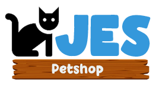

<div align="center">
  <h1>Welcome to Jes Petshop Project,<br> Online shop for pet keepers</h1>


<!-- PROJECT LOGO -->


</div>

## 📑 About the Project

An online shop website for Jes Petshop, My first paid website.

## 🌐 Deployment

- [Vercel](https://les-goo.vercel.app/)

## 🖼 Prototype

- [FIGMA](https://www.figma.com/file/jMBzc4iIBLjwRcB5A1FL15/Prototype?node-id=0%3A1)

### ⚙ Backend

- Starappi

## 🔮 Features

- Sign up
- Login
- Logout

### 🌟 As User

- 

### ✨ As Administrator

- 

## 🧰 Installation

Clone this project

```sh
git clone https://github.com/tawakalmit/Jes-Petshop-NextJs.git
cd Jes-Petshop-NextJs
```

#### ⌛ Install

```sh
npm install
```

#### 🚀 Usage

```sh
npm run dev
```

## 🛠️ Built With

- [NextJS (ReactJS Framework)](https://nextjs.org/)
- [TailwindCSS](https://tailwindcss.com/)
- [React-Leaflet](https://react-leaflet.js.org/)
- [Firebase Cloud Messsaging](https://firebase.google.com/docs/cloud-messaging)
- [Next](https://www.npmjs.com/package/next)
- [React](https://www.npmjs.com/package/react)
- [React Dom](https://www.npmjs.com/package/react-dom)
- [React Icons](https://www.npmjs.com/package/react-icons)
- [Sweetalert2](https://www.npmjs.com/package/sweetalert2)
- [Progressive Web Apps](https://web.dev/progressive-web-apps/)
- [Headless UI](https://headlessui.com/)
- [Cookies Next js](https://www.npmjs.com/package/cookies-next)
- [Local Forage](https://www.npmjs.com/package/localforage)
- [FNS Date](https://www.npmjs.com/package/date-fns)
- [react toastify](https://www.npmjs.com/package/react-toastify)

<!-- CONTACT -->

## 🤖 Author

- Muhammad Ikbal Tawakal
  - [Github](https://github.com/tawakalmit)
  - [Personal Website](https://www.mikbaltawakal.cf/)
